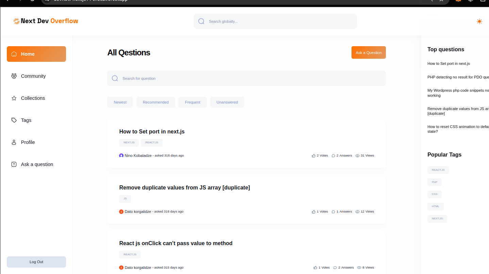
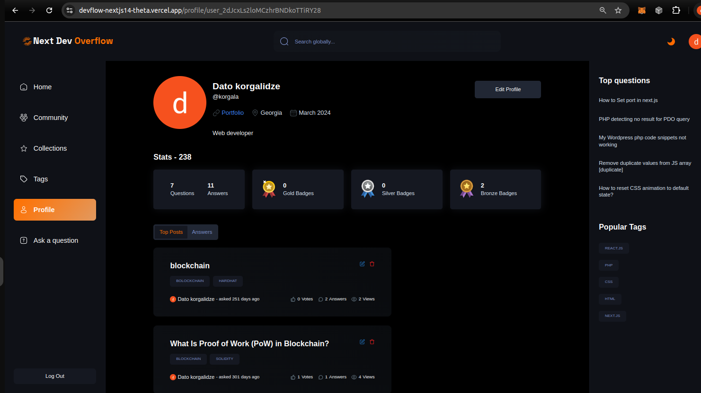
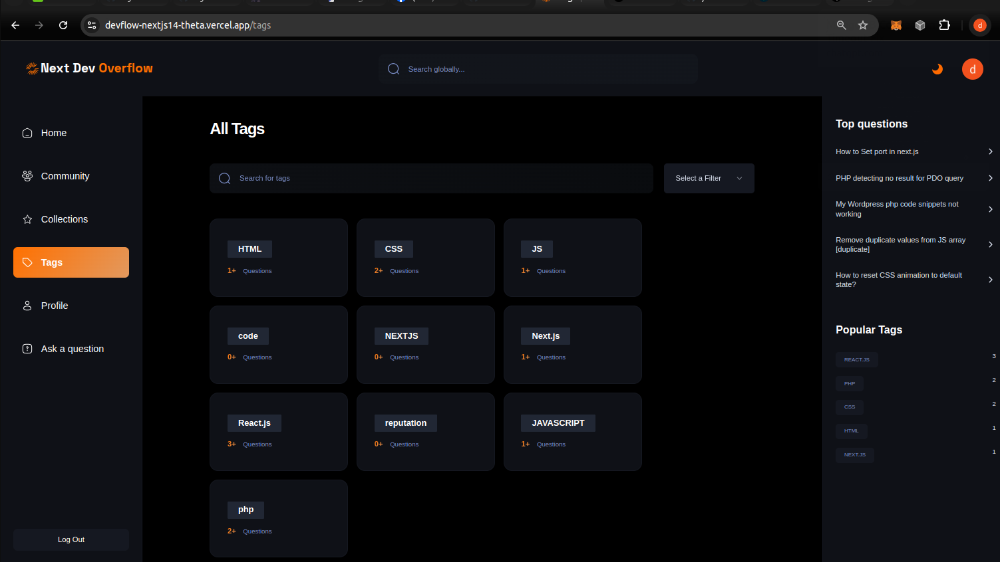

# DEV Overflow

### Introducing the Pinoy Overflow!

It's not just a website; it's a community-driven platform designed to empower newcomers to the world of web development. Dev Overflow serves as a "Stack Overflow" for those seeking answers and guidance in their web development journey.

## Key Features:

- React and TypeScript: These technologies ensure a smooth and interactive user experience, making it easy to browse and ask questions.
- Next.js: With Next.js, the site is not only fast but also optimized for search engines, helping users find answers to their web development queries.
- Tailwind CSS: The clean and modern design, thanks to Tailwind CSS, enhances the overall usability of Pinoy Overflow.
- MongoDB: MongoDB helps manage user data and content effectively, making it a valuable resource for web development queries.

## Dark Mode Theme

Dev Overflow is more than just a website; it's a vibrant community of web enthusiasts helping each other grow. Whether you're a newbie or an experienced developer, you'll find a welcoming space to ask questions, share knowledge, and collaborate.

DAVID KORGALIDZE
